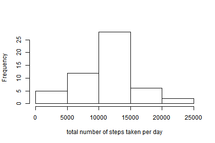
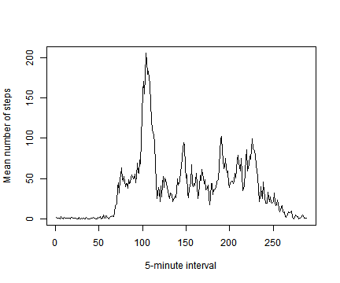
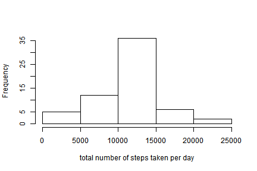
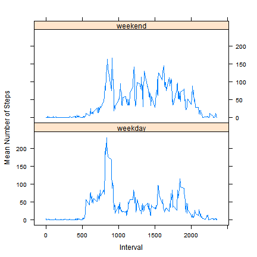

# Reproducible Research: Peer Assessment 1

This assignment makes use of data from a personal activity monitoring device. This device collects data at 5 minute intervals through out the day. The data consists of two months of data from an anonymous individual collected during the months of October and November, 2012 and include the number of steps taken in 5 minute intervals each day.

## Loading and preprocessing the data

The data for this assignment can be downloaded from https://d396qusza40orc.cloudfront.net/repdata%2Fdata%2Factivity.zip

The dataset, stored in a csv file, contains 17,568 observations and 3 variables:
- steps: Number of steps taking in a 5-minute interval (missing values are coded as NA)
- date: The date on which the measurement was taken in YYYY-MM-DD format
- interval: Identifier for the 5-minute interval in which measurement was taken


```r
activity <- read.csv(unz("activity.zip", "activity.csv"), colClasses = c("numeric", 
    "Date", "numeric"))

# Compute the total number of steps for each day
sumsteps <- tapply(activity$steps, activity$date, sum)
```


## What is mean total number of steps taken per day?
To get a sense of the data, we plot a histogram of the total number of steps taken each day

```r
hist(sumsteps, xlab = "total number of steps taken per day", main = NULL)
```

 

```r

# Compute mean and median total num steps taken each day}
options(scipen = 1, digits = 1)  ## to fix the number displayed
meansteps <- mean(sumsteps, na.rm = T)
mediansteps <- median(sumsteps, na.rm = T)
```

The mean total number of steps taken each day is 10766.2.
The median total number of steps taken each day is 10765.

## What is the average daily activity pattern?
To visualise the average daily activity pattern, We make a time series plot of the 5-minute interval and the average number of steps taken, averaged across all days.

```r
meansteps <- tapply(activity$steps, as.factor(activity$interval), mean, na.rm = T)

df <- data.frame(dimnames(meansteps), unlist(meansteps))
colnames(df) <- c("interval", "stepmean")

plot(df$stepmean, type = "l", xlab = "5-minute interval", ylab = "Mean number of steps")
```

 

```r

## find time interval mean number of steps is max
int <- df[which.max(df$stepmean), 1]
```

The 288 5-minute intervals in a day are numbered from 1 to 288 (from 0000h to 2355h) on the horizontal axis. 

Not surprisingly, the mean number of steps is practically zero for the first 70 or so intervals as these intervals correspond to the period from midnight to about 6 am when the subject is presumably sleeping. 

The maximum mean number of steps occur at 835h, which is presumably when the subject is on his way to office/school.

There are 3 more peaks at lunch time, tea time and dinner time.

## Imputing missing values

```r
numNA <- sum(is.na(activity$steps))
```

Total number intervals with missing values is 2304.

The presence of missing values may introduce bias into some calculations of the data. We fill in all the missing values by the mean number of steps for that interval.


```r
# Create a new variable (impute) for steps with missing steps values
# replaced by mean number of steps for that interval
activity$impute <- activity$steps
for (i in seq_along(activity[, 1])) {
    activity[i, 4] <- ifelse(is.na(activity[i, 1]), df[which(activity[i, 3] == 
        df$interval), 2], activity[i, 1])
}
```


```r
## Compute the total number of steps for each day
newsumsteps <- tapply(activity$impute, activity$date, sum)

hist(newsumsteps, xlab = "total number of steps taken per day", main = NULL)
```

 


```r
options(scipen = 1, digits = 1)  ## to fix the number displayed
newmean <- mean(newsumsteps)
newmedian <- median(newsumsteps)
```

When the missing data is filled in, 
- the mean total number of steps taken each day is 10766.2, which is the same as the mean in the orignial data;
- the median total number of steps taken each day is 10766.2, which is the same as the mean for the filled in data. This is slightly bigger than the median in the original data. 

From the histogram and the values of the mean and median, the distribution of the total daily number of steps is more symmetrical when the missing data is imputed.  

## Are there differences in activity patterns between weekdays and weekends?

```r
activity$day <- weekdays(as.Date(activity$date))
activity$daytype <- as.factor(ifelse(activity$day == "Saturday" | activity$day == 
    "Sunday", "weekend", "weekday"))

library(plyr)
# loads plyr package to find mean number of steps averaged across all
# weekdays and weekends.
df2 <- ddply(activity, c("daytype", "interval"), summarise, mean_steps = mean(impute))

library(lattice)
# loads lattice package
xyplot(mean_steps ~ interval | daytype, df2, layout = c(1, 2), type = "l", xlab = "Interval", 
    ylab = "Mean Number of Steps")
```

 

The horizontal axis gives the intervals indicated 0, 5, 10, 15 ... 2355 corresponding to the time from 0000h to 2355h. 

From the 2 graphs, we see that although the peak on weekends is lower than the peak on weekdays, the subject is more active physically on weekends, especially for the period from 1000h to 2000h.
